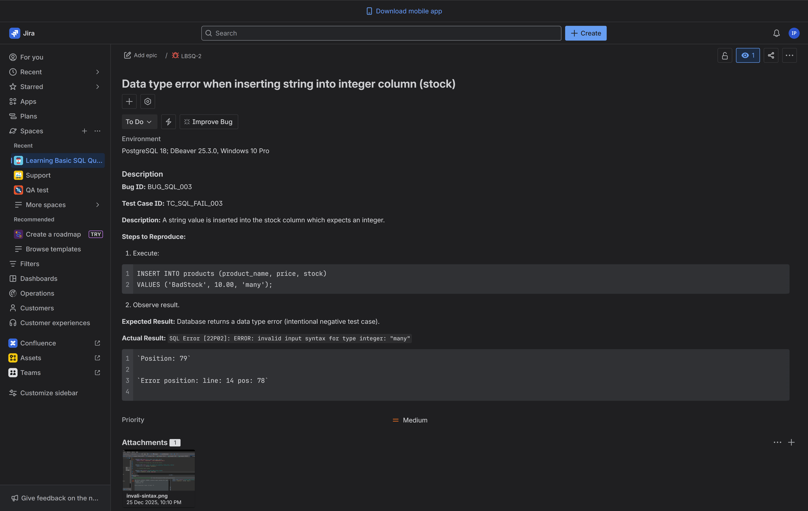

**Bug ID:** BUG_SQL_003

**Title:** Data type error when inserting string into integer column (stock)

**Test Case ID:** TC_SQL_FAIL_003

**Environment:** PostgreSQL 18; DBeaver 25.3.0; Windows 10 Pro

**Reported By:** Igor Protsenko

**Description:**
A string value is inserted into the stock column which expects an integer.

**Steps to Reproduce:**

1. Execute:
```sql
INSERT INTO products (product_name, price, stock)
VALUES ('BadStock', 10.00, 'many');
```

2. Observe result.

**Expected Result:***
Database returns a data type error (intentional negative test case).

**Actual Result:**
`SQL Error [22P02]: ERROR: invalid input syntax for type integer: "many"`
  
	`Position: 79`

	`Error position: line: 14 pos: 78`

- **Screenshot** :



- **Link for Jira** : ![https://igor2012lww.atlassian.net/browse/LBSQ-2]


- Severity: Medium

- Priority: Medium

- Status: Open
