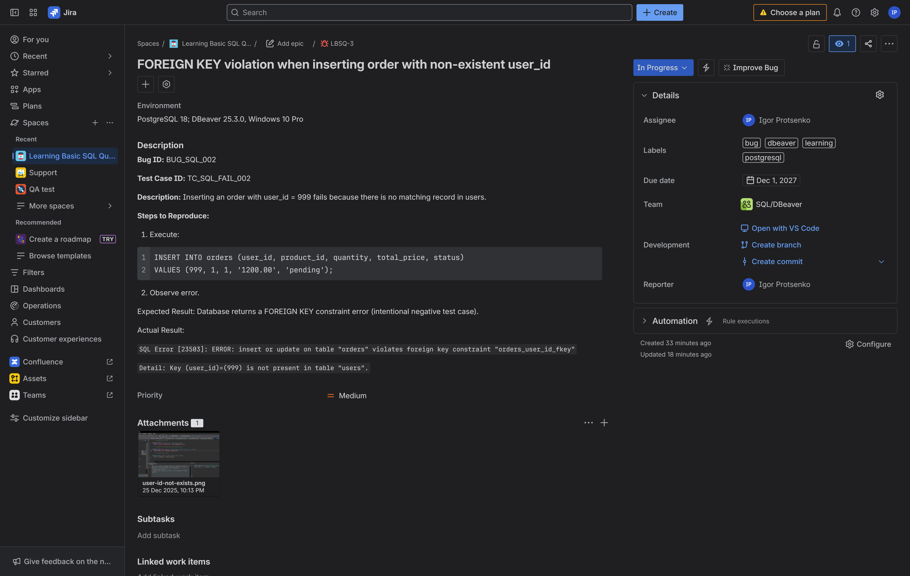

**Bug ID:** BUG_SQL_002

**Title:** FOREIGN KEY violation when inserting order with non-existent user_id

**Test Case ID:** TC_SQL_FAIL_002

**Environment:** PostgreSQL 18; DBeaver 25.3.0

**Reported By:** Igor Protsenko

**Description:**
Inserting an order with user_id = 999 fails because there is no matching record in users.

**Steps to Reproduce:**

1. Execute:
```sql
INSERT INTO orders (user_id, product_id, quantity, total_price, status)
VALUES (999, 1, 1, '1200.00', 'pending');
```

2. Observe error.

Expected Result:
Database returns a FOREIGN KEY constraint error (intentional negative test case).

Actual Result:

`SQL Error [23503]: ERROR: insert or update on table "orders" violates foreign key constraint "orders_user_id_fkey"`
 	
  `Detail: Key (user_id)=(999) is not present in table "users".`


- **Link for Jira** : https://igor2012lww.atlassian.net/browse/LBSQ-3

- **Screenshot** :




- Severity: High

- Priority: High

- Status: Open
