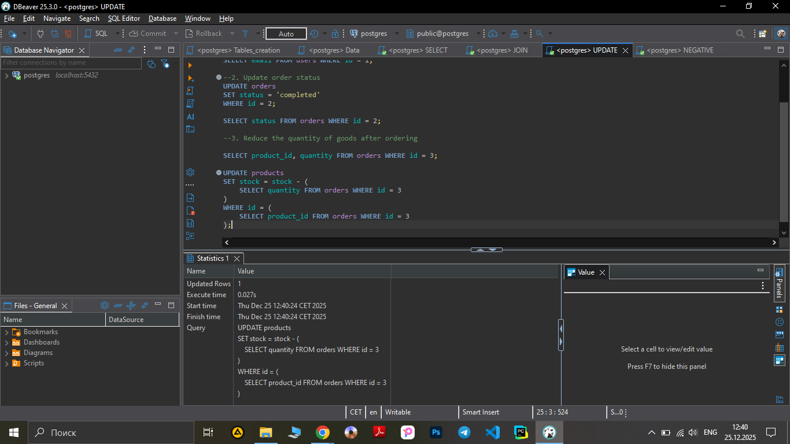
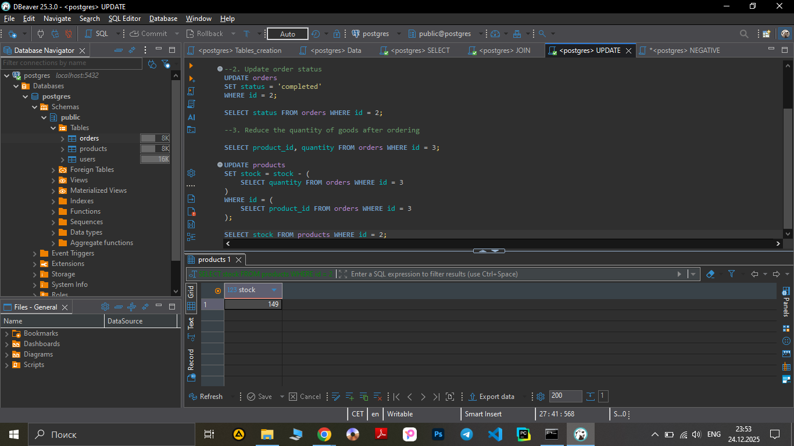

**Test Case ID:** TC_SQL_005

**Title:** Reduce the quantity of goods in stock

**Preconditions:**
Database is available. Tables users, orders exists. Order with id = 3 exists, and contains product_id =2, quantitu = 1.
-Steps:

1.Execute:
```sql 
SELECT product_id, quantity 
FROM orders 
WHERE id = 3;
``` 
-**Screenshot** :


Check that the result return with product_id = 2, quantity = 1.

2. Execute:
```sql
UPDATE products
SET stock = stock - (
    SELECT quantity FROM orders WHERE id = 3
)
WHERE id = (
    SELECT product_id FROM orders WHERE id = 3
);
```
-**Screenshot** :




Verify change:
```sql
SELECT stock FROM products WHERE id = 2;
```
-**Screenshot-of-result** :




**Expected Result:**
Stock of product with id = 2 decreases from 150 to 149.

**Actual Result:**
UPDATE Query executed successfully. Stock changed from 150 to 149

- Priority: Medium

- Test Type: Positive

- Status: Pass
