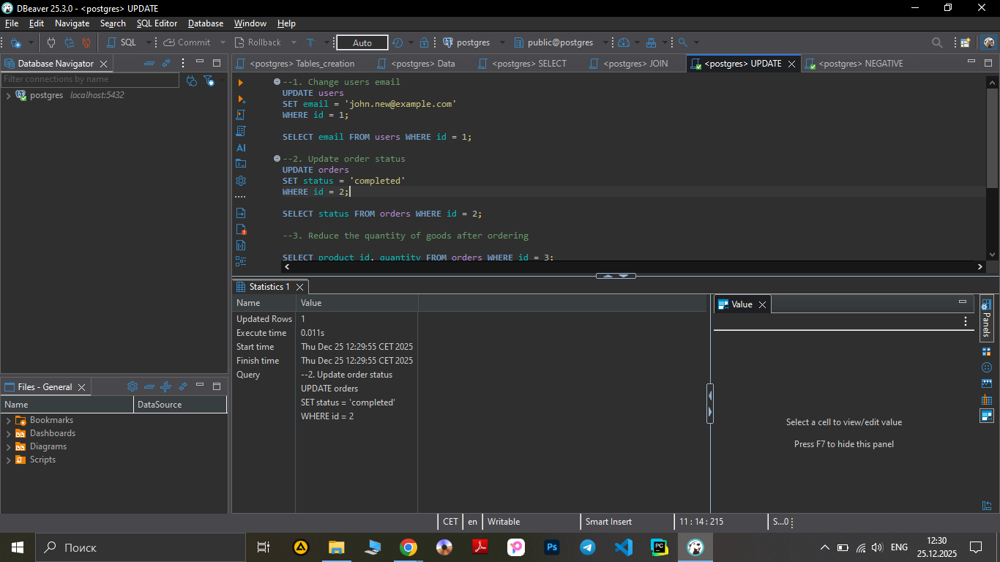

**Test Case ID:** TC_SQL_008

**Title:** Update order status 

**Preconditions:**
Database is available. Table orders exists. Order with id = 2 exists.

-Steps:

1.Execute:
```sql
UPDATE orders
SET status = 'completed'
WHERE id = 2;
```
-**Screenshot** :




Verify change:
```sql
SELECT status FROM orders WHERE id = 2;
```
-**Screenshot-of-result** :


**Expected Result:**
Order with id = 2 will change status to completed.

**Actual Result:**
UPDATE executes successfully. SELECT confirms new status is applied.

- Priority: High

- Test Type: Positive

- Status: Pass
