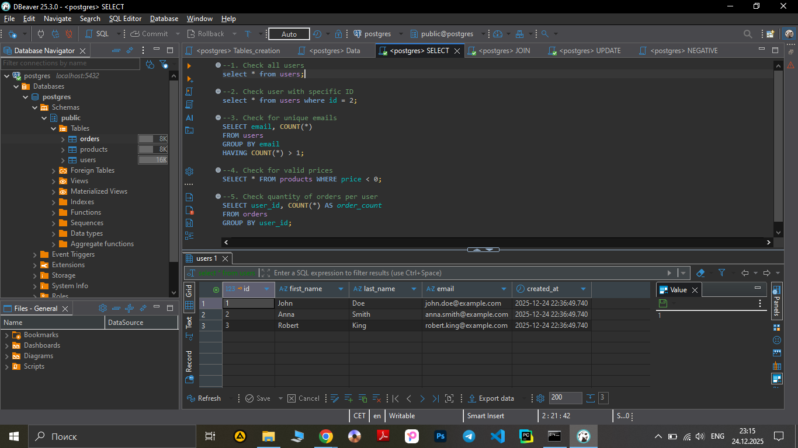

**Test Case ID:** TC_SQL_009

**Title:** Verify SELECT all users

**Preconditions:** Database is available, table users exists

- Steps:
1. Execute: 
```sql
SELECT * FROM users;
```
-**Screenshot** :




2. Check returned rows and fields

**Expected Result:** 3 rows, fields: id, first_name, last_name, email, created_at

**Actual Result:** Query executed succesfully. 3 rows returned wiht fields: id, first_name, last_name, email, created_at. 

- Priority: High

- Test Type: Positive

- Status: PASS
