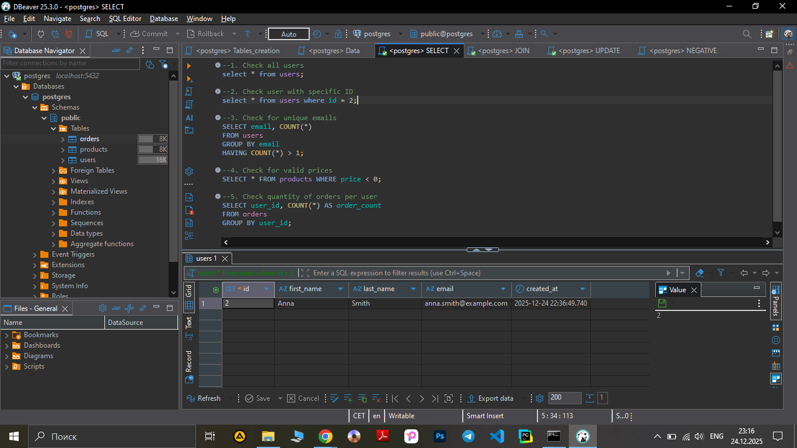

**Test Case ID:** TC_SQL_010

**Title:** Verify SELECT user with specific ID

**Preconditions:** Database is available, table with users exists

- Steps:

1. Execute: 
```sql
SELECT * FROM users where id = 2;
```
-**Screenshot** :



2. Check returned data

**Expected Result:** 1 row, for user with ID = 2, first_name, last_name, email, created at

**Actual Result:** Query executed successfuly. Database responds correct, user with ID = 2, first_name, last_name, email, created at

- Priority: High

- Test Type: Positive

- Status: Pass
