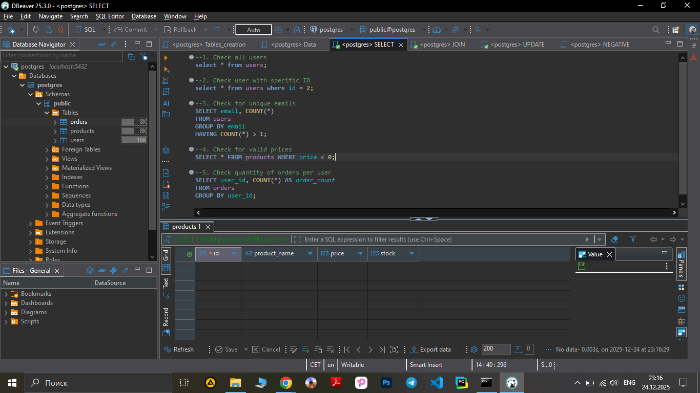

**Test Case ID:** TC_SQL_011

**Title:** Verifying of valid prices for products

**Preconditions:** Database is available, table "products" exists. 

- Steps:

1. Execute:

```sql
SELECT * FROM products WHERE price < 0;
```
-**Screenshot** :




2. Check returned data

**Expected Result:** Returns empty data.
 
**Actual Result:** Query executed successfuly. Empty data returns, all prices are above 0. No negative prices. 

- Priority: High

- Test Type: Positive 

- Status: Pass
