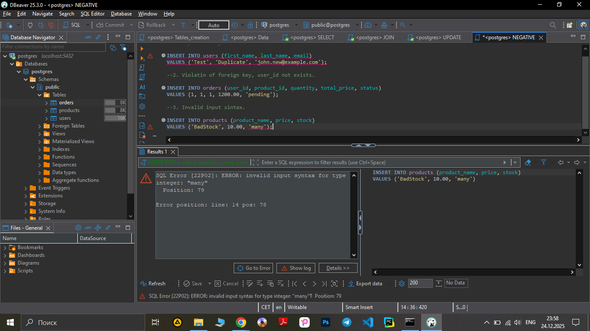

**Test Case ID:** TC_SQL_FAIL_001

**Title:** Invalid input sintax. 

**Preconditions:**

Database is available. Table products exists.
- Steps:

1. Execute:

```sql
INSERT INTO products (product_name, price, stock)
VALUES ('BadStock', 10.00, 'many');
```

2. Observe system response.

-**Screenshot** :




**Expected Result:**

Database returns an error:

System returns error of invalid input sintax. 

**Actual Result:**
System correctly returns an error. 

SQL Error [22P02]: ERROR: invalid input syntax for type integer: "many"

- Priority: Medium

- Test Type: Negative

- Status: Pass
