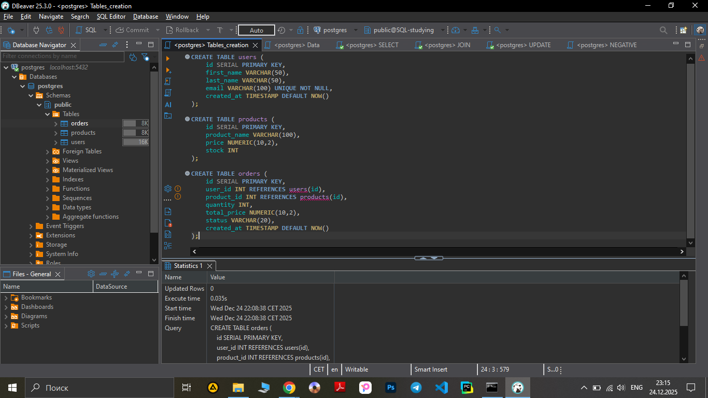

**SQL Test Plan — PostgreSQL Database**

**Objective**

To test the basic functionality of the database using SQL queries (SELECT, JOIN, UPDATE, INSERT), identify bugs, and ensure that the database returns correct results and handles errors properly.

**Test Object**

- PostgreSQL database with the following tables:

`users`

`products`

`orders`

**Database creating screenshots** : 

**Tools**

- DBeaver 25.3.0 — for executing SQL queries

- PostgreSQL 18 — database engine

- Google Sheets / Notepad — for test cases, bug reports, and documentation

- GitHub — for storing artifacts

**Types of Testing**
1. Functional SQL Testing

- Verifying that SELECT, JOIN, and UPDATE queries return correct data

2. Positive Testing

- Valid queries

- Expected successful result

- Updates applied correctly

3. Negative Testing

- Duplicate values 

- Incorrect foreign keys (FK violation)

- Wrong data types (integer vs. text, etc.)

4. Data Validation

- Check calculations (order count, total order amounts)

- Check that stock decreases properly

- Check that product prices are valid (no negative numbers)

**Test Start Criteria**

- Database is created

- Tables exist (users, products, orders)

- Initial test data is inserted

- SQL test cases and checklist are ready

**Test Completion Criteria**

- All SQL test cases executed

- All positive and negative tests completed

- All bugs documented

- Checklist fully covered

**Test Objects (What Will Be Tested)**

1. SELECT Tests

- Get all users

- Get user by ID

- Get users with their orders (JOIN)

- Get users with no orders (LEFT JOIN)

- Check product prices

- Check order counts per user

- Check total order amounts

2. UPDATE Tests

- Update user email

- Update order status

- Reduce product stock after order

3. Negative Tests

- Insert user with duplicate email (UNIQUE)

- Insert order with invalid user_id (FOREIGN KEY)

- Insert invalid data type (e.g., text instead of number)
